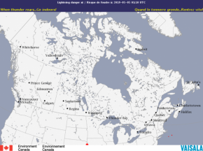
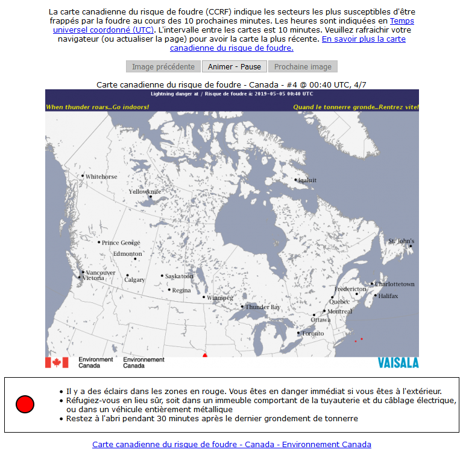

# Environment Canada Lightning Danger script (for www.weatheroffice.ec.gc.ca)

This script will read the HTML from the [Environment Canada Lightning Danger Map](http://weather.gc.ca/lightning/index_e.html) page (cached) and download/cache the lightning map images as .png files on your website. Since the EC uses lightning graphic names with embedded timestamps, this script offers one of the few ways that weather enthusiasts can include EC lightning map images in their own websites.

The ec-lightning.php script uses a subdirectory (./radar/ default) to store the contents of the EC lightning HTML pages and the current lightning graphics. For proper operation of the script, you need to ensure that the cache directory is writable by PHP scripts. A simple test script is included to check this (_ec-lightning-cachetest.php_).

The script will load the HTML page from the EC website, cache it, and parse the contents for the lightning graphic images available, then download, resize and cache the images in ./radar/lightning-AAA-N.png files (AAA=siteid, N=0 (oldest) to 6 (most recent). Then the script will generate HTML and JavaScript to display the graphics from the cache and the associated date stamps for the lightning map images. The script generates uniquely named JavaScript functions/variables to allow you to embed more than one Lightning set on a page (as shown below). A smaller (1/4 size) image is also available of the most recent lightning map image as ./radar/lightning-AAA-sm.png. The following parameters are available on the ec-lightning.php script:

<dl>

<dt>**id=AAA**</dt>

<dd>If present, the script will load lightning map images from the 'AAA' lightning site. The available lightning maps are:<br>  
  **id=NAT** - National lightning (script default $lightningID) <br> 
  **id=PAC** - Pacific region lightning <br> 
  **id=WRN** - Prairies region lightning <br> 
  **id=ONT** - Ontario region lightning <br> 
  **id=QUE** - Quebec region lightning <br> 
  **id=ATL** - Atlantic region lightning  
</dd>

<dt>**lang=en**</dt>

<dd>(Default) Text is in English..</dd>

<dt>**lang=fr**</dt>

<dd>Text is in French .</dd>

<dt>**play=yes**</dt>

<dd>(default)--Start the JavaScript animation when page is loaded.</dd>

<dt>**play=no**</dt>

<dd>Don't start the animation when the page is loaded. Viewer must press play-stop button to start animation.</dd>

<dt>**imgonly=Y**</dt>

<dd>Return a 1/4 size static image of the latest lightning selected.  
This is for use in an  statement on your page.
See example 1 below for usage.<br>  
Note: the small lightning map images are width="290" and vary in height.  
</dd>

</dl>

For webmaster help with debugging the setup/configuration of the script, the following parameters may also be used:

<dl>

<dt>**cache=no**</dt>

<dd>Forces refresh of EC lightning page and lightning map images .</dd>

</dl>

### Settings inside the script

If you create a writable /lightning subdirectory in the document root of your webserver, then the only settings you should change are $siteID and $defaultLang.

```php
// Settings:
// --------- start of settings ----------
//
//  Go to http://weather.gc.ca/lightning/index_e.html
//  Click on the desired area page.
//  You should see a lightning page with an url like
//     http://weather.gc.ca/lightning/index_e.html?id=XXX
//  copy the three letter area id=XXX into $lightningID = 'XXX'; below
//
$lightningID = 'NAT';      // set to default Site for lightning (same as id=xxx on EC website)
//                         // available sites: NAT ARC PAC WRN ONT QUE ATL
$defaultLang = 'en';  // set to 'fr' for french default language
//                    // set to 'en' for english default language
//
$lightningCacheName = 'ec-lightning.txt';     // note: will be changed to -en.txt or
//                                  -fr.txt depending on language choice and stored in $lightningDir
$lightningDir = './radar/';  // directory for storing lightning-XXX-0.png to lightning-XXX-6.png images
//                             note: relative to document root.
$lightningWidth = 620;  // width of images to output in pixels.  default=620
//
$refetchSeconds = 300;  // look for new images from EC every 5 minutes (300 seconds)
//                      NOTE: EC may take up to 20 minutes to publish new images    
$noLightningMinutes = 25;   // minutes to wait before declaring the image site as 'N/O -not operational'
//
$aniSec = 1; // number of seconds between animations
//
$charsetOutput = 'ISO-8859-1';   // default character encoding of output
// ---------- end of settings -----------
```

## Example 1 - Current default lightning small image

```html

```
Results in:



## Example 2 - Canada National Lightning in French

```php
<?php
  $doInclude = true;
  $doPrint = true;
  $doAutoPlay = true;
  $doLang = 'fr';
  include_once("ec-lightning.php");
?>

```

Results in a National lightning like this (in French):



## Installation Instructions

1.  Upload _ec-lightning-cachetest.php_ to your website (in your document root directory).
2.  If you are NOT already using the _ec-radar.php_ script, then create a new **./radar/** directory on the webserver one directory below where you placed the script, and upload the _legendLightning.png_ file to that directory.
3.  Run _ec-lightning-cachetest.php_ script from your browser.  
    If the _ec-lightning-cachetest.php_ reports success in writing the file, finding the needed _legendLightning.png_ and that GD is installed, then proceed to step 4\.
      
    If you have error messages appearing, then you'll have to fix the problem on your webserver (by changing the permissions on the **./radar/** directory to 755, or 775 on Linux/Unix systems, or allowing 'all' to read/write/create on IIS system). The _ec-lightning.php_ program requires the use of cache files, so you'll have to get a clean run on _ec-lightning-cachetest.php_ to have _ec-lightning.php_ run successfully.
4.  Edit _ec-lightning.php_ to change other settings (_$lightningID_) as you like.
5.  Upload _ec-lightning.php_ to the same directory that successfully ran _ec-lightning-cachetest.php_.
6.  View _ec-lightning.php_ with your browser. You should see the animation of your selected (_$lightningID_) lightning map.
7.  Install links in your other webpages for the lightning map images you desire.

Note: this script is included with the [AJAX/PHP Base-Canada template sets (English and bilingual English/French)](https://saratoga-weather.org/wxtemplates/index.php).  It is also available (with instructions) at [Saratoga Weather script page](https://saratoga-weather.org/scripts-EClightning.php#EClightning).
